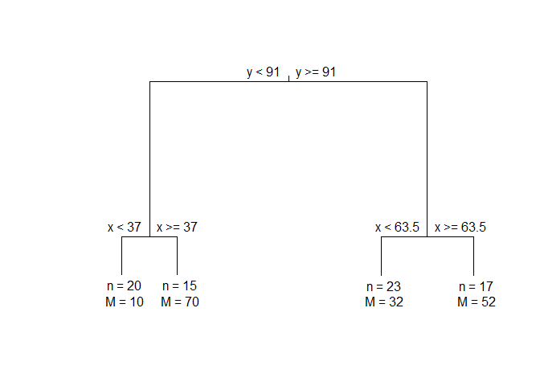

<!-- README.md is generated from README.Rmd. Please edit that file -->

# monoClust

<!-- badges: start -->

[](https://travis-ci.org/vinhtantran/monoClust)
[](https://CRAN.R-project.org/package=monoClust)
[](https://www.tidyverse.org/lifecycle/#stable)
<!-- badges: end -->

Implementation of the Monothetic Clustering algorithm on continuous data
set. A lot of extensions are included in the package, including applying
Monothetic clustering on data set with circular variables,
visualizations with the results, and permutation and cross-validation
based tests to support the decision on the number of clusters.

The package performs Monothetic clustering on numerical variables only
data. The extended features include clustering on one circular variable,
limiting the sets of splitting variables. There are also S3 functions
such as print and plot that works for MonoClust output object.

## Installation

You can install the released version of monoClust from
[CRAN](https://CRAN.R-project.org) with:

``` r
install.packages("monoClust")
```

And the development version from [GitHub](https://github.com/) with:

``` r
# install.packages("devtools")
devtools::install_github("vinhtantran/monoClust")
```

## Example

This is a basic example which shows you how to solve a common problem:

``` r
library(monoClust)
library(cluster)
data(ruspini)
ruspini4sol <- MonoClust(ruspini, nclusters = 4)
ruspini4sol
#> n = 75 
#> 
#> Node) Split, N, Cluster Inertia, Proportion Inertia Explained,  
#>       * denotes terminal node
#> 
#> 1) root 75 244373.900 0.6344215   
#>   2) y < 91 35  43328.460 0.9472896   
#>     4) x < 37 20   3689.500   *
#>     5) x >= 37 15   1456.533   *
#>   3) y >= 91 40  46009.380 0.7910436   
#>     6) x < 63.5 23   3176.783   *
#>     7) x >= 63.5 17   4558.235   *
#> 
#> Note: One or more of the splits chosen had an alternative split that
#>         reduced inertia by the same amount. See "alt" column of "frame"
#>         object for details.
```

Plotting MonoClust tree:

``` r
plot(ruspini4sol)
```


